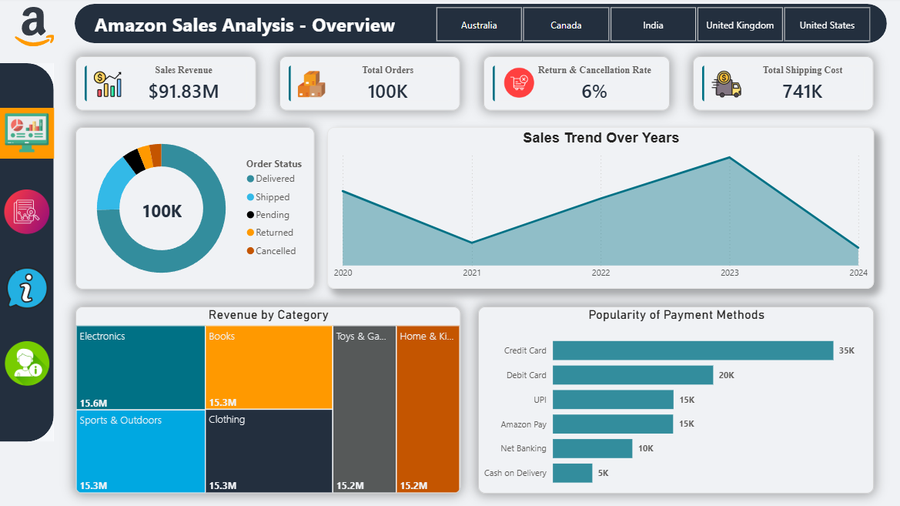

# 📊 Amazon Sales Analysis Dashboard

## 📝 **Project Overview**
This **Power BI project** provides a comprehensive analysis of Amazon's global sales data ($91.83M Revenue). The dashboard is designed to transform raw transactional data into actionable business intelligence, focusing on sales performance, operational efficiency, and high-risk product categories.

---

## 🚀 **Key Features**
* **Executive Overview:** Real-time tracking of Sales Revenue, Total Orders, and Shipping Costs.
* **Product Return Deep-Dive:** Specialized analysis of return and cancellation rates (6% avg) to mitigate losses.
* **Geographic Insights:** Performance comparison across global markets (Australia, Canada, India, UK, USA).
* **Advanced Visualization:** Interactive Scatter charts for Profitability vs Quality analysis.
* **Custom UI/UX:** An Amazon-themed interface with a dynamic navigation sidebar and synchronized filters.

---

## 🛠️ **Technical Methodology**
* **Data Modeling:** Optimized flat-table architecture for high-performance reporting.
* **DAX Measures:** Developed custom calculations for ROI, Return Rates, and dynamic KPIs.
* **Power Query:** Automated ETL processes for data cleaning and transformation.
* **User Interface:** Professional layout with integrated shadows, custom icons, and consistent branding.

---

## 📁 **Repository Structure**
* `Amazon Sales Analysis.pbix`: The main Power BI project file.
* `/Data`: Contains the raw dataset.
* `/Screenshots`: Visual preview of the dashboard pages.
* `Theme.json`: Custom color palette used for the dashboard.

---

## 🤝 **Connect with me**
* **LinkedIn:** https://www.linkedin.com/in/tawadros-samy/
* **Email:** tawadrossamy.official@gmail.com

---

## 🖼️ **Dashboard Preview**

### **1. Executive Overview**

### **2. Product Return Deep-Dive**

### **3. Project Info & Insights**

### **4. About Me**
